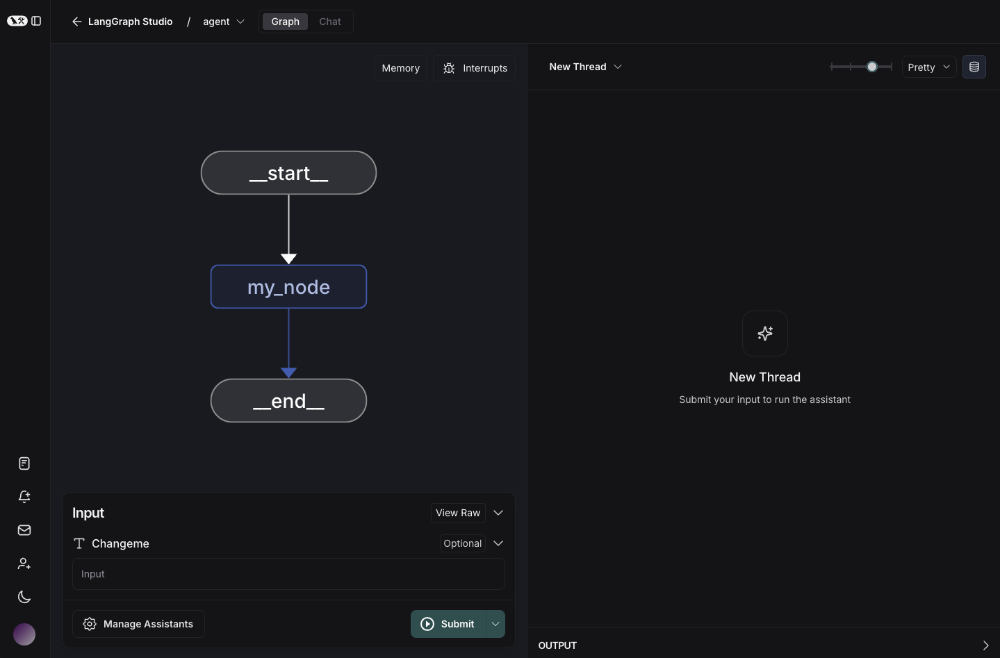

# Deployment quickstart

This guide shows you how to set up and use LangGraph Platform for a cloud deployment.

## Prerequisites

Before you begin, ensure you have the following:

- A [GitHub account](https://github.com/)
- A [LangSmith account](https://smith.langchain.com/) – free to sign up

## 1. Create a repository on GitHub

To deploy an application to **LangGraph Platform**, your application code must reside in a GitHub repository. Both public and private repositories are supported. For this quickstart, use the [`new-langgraph-project` template](https://github.com/langchain-ai/react-agent) for your application:

1. Go to the [`new-langgraph-project` repository](https://github.com/langchain-ai/new-langgraph-project) or [`new-langgraphjs-project` template](https://github.com/langchain-ai/new-langgraphjs-project).
1. Click the `Fork` button in the top right corner to fork the repository to your GitHub account.
1. Click **Create fork**. 

## 2. Deploy to LangGraph Platform

1. Log in to [LangSmith](https://smith.langchain.com/).
1. In the left sidebar, select **LangGraph Platform**.
1. Click the **+ New Deployment** button. A pane will open where you can fill in the required fields.
1. If you are a first time user or adding a private repository that has not been previously connected, click the **Import from GitHub** button and follow the instructions to connect your GitHub account.
1. Select your New LangGraph Project repository.
1. Click **Submit** to deploy.

    This may take about 15 minutes to complete. You can check the status in the **Deployment details** view.

## 3. Test your application in LangGraph Studio

Once your application is deployed:

1. Select the deployment you just created to view more details.
1. Click the **LangGraph Studio** button in the top right corner.

    LangGraph Studio will open to display your graph.

    <figure markdown="1">
    [{: style="max-height:400px"}](deployment/img/langgraph_studio.png)
    <figcaption>
        Sample graph run in LangGraph Studio.
    </figcaption>
    </figure>

## 4. Get the API URL for your deployment

1. In the **Deployment details** view in LangGraph, click the **API URL** to copy it to your clipboard.
1. Click the `URL` to copy it to the clipboard.

## 5. Test the API

You can now test the API:

=== "Python SDK (Async)"

    1. Install the LangGraph Python SDK:

        ```shell
        pip install langgraph-sdk
        ```

    1. Send a message to the assistant (threadless run):

        ```python
        from langgraph_sdk import get_client

        client = get_client(url="your-deployment-url", api_key="your-langsmith-api-key")

        async for chunk in client.runs.stream(
            None,  # Threadless run
            "agent", # Name of assistant. Defined in langgraph.json.
            input={
                "messages": [{
                    "role": "human",
                    "content": "What is LangGraph?",
                }],
            },
            stream_mode="updates",
        ):
            print(f"Receiving new event of type: {chunk.event}...")
            print(chunk.data)
            print("\n\n")
        ```

=== "Python SDK (Sync)"

    1. Install the LangGraph Python SDK:

        ```shell
        pip install langgraph-sdk
        ```

    1. Send a message to the assistant (threadless run):

        ```python
        from langgraph_sdk import get_sync_client

        client = get_sync_client(url="your-deployment-url", api_key="your-langsmith-api-key")

        for chunk in client.runs.stream(
            None,  # Threadless run
            "agent", # Name of assistant. Defined in langgraph.json.
            input={
                "messages": [{
                    "role": "human",
                    "content": "What is LangGraph?",
                }],
            },
            stream_mode="updates",
        ):
            print(f"Receiving new event of type: {chunk.event}...")
            print(chunk.data)
            print("\n\n")
        ```

=== "JavaScript SDK"

    1. Install the LangGraph JS SDK

        ```shell
        npm install @langchain/langgraph-sdk
        ```

    1. Send a message to the assistant (threadless run):

        ```js
        const { Client } = await import("@langchain/langgraph-sdk");

        const client = new Client({ apiUrl: "your-deployment-url", apiKey: "your-langsmith-api-key" });

        const streamResponse = client.runs.stream(
            null, // Threadless run
            "agent", // Assistant ID
            {
                input: {
                    "messages": [
                        { "role": "user", "content": "What is LangGraph?"}
                    ]
                },
                streamMode: "messages",
            }
        );

        for await (const chunk of streamResponse) {
            console.log(`Receiving new event of type: ${chunk.event}...`);
            console.log(JSON.stringify(chunk.data));
            console.log("\n\n");
        }
        ```

=== "Rest API"

    ```bash
    curl -s --request POST \
        --url <DEPLOYMENT_URL> \
        --header 'Content-Type: application/json' \
        --data "{
            \"assistant_id\": \"agent\",
            \"input\": {
                \"messages\": [
                    {
                        \"role\": \"human\",
                        \"content\": \"What is LangGraph?\"
                    }
                ]
            },
            \"stream_mode\": \"updates\"
        }" 
    ```


## Next steps

Congratulations! You have deployed an application using LangGraph Platform.

Here are some other resources to check out:

- [LangGraph Platform overview](../concepts/langgraph_platform.md)
- [Deployment options](../concepts/deployment_options.md)


